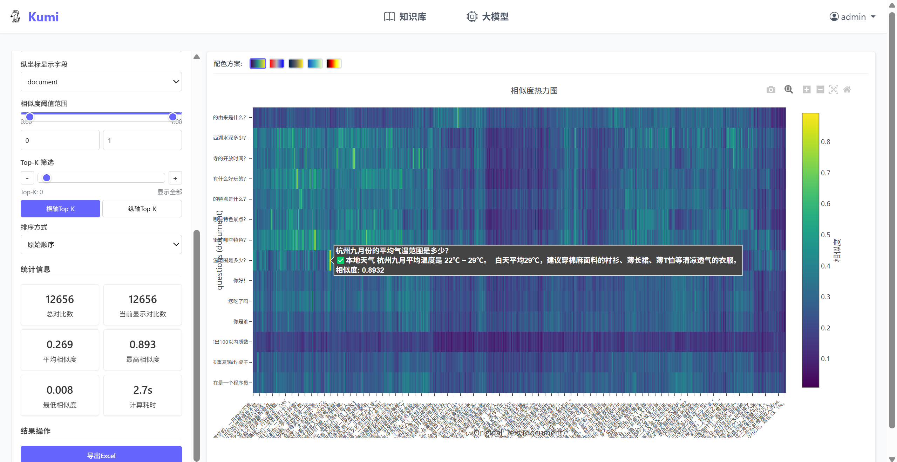

# KUMI
项目目标: 可视化的知识库测试；dify/coze 等工作流搭建平台的补充工具



## 功能:
1. 更自由化的知识库构建（清洗 切分） 暴露api接口给平台调用
2. 高可视化的测评 自动化测试（embedding llm 前者直接进行本地召回操作 后者调用dify api）
3. 启动必要的插件接口（在网络层）

## 部署方法
以下包含三个部分 KUMI 知识库 向量化API。三者通过网络层连接，以下仅为方便部署举例，实际使用过程中知识库和向量化API可改为自己的。

### KUMI
```sh
# uv的安装和使用
# https://docs.astral.sh/uv/getting-started/installation/

# 创建环境并激活
uv venv --python 3.12
.venv\Scripts\activate

uv init
uv pip install -r requirements.txt -i https://pypi.tuna.tsinghua.edu.cn/simple

# 生成.env (记得修改！)
cp settings/.env.example settings/.env

# 先等chroma和向量化 都启动了再执行这步
uv run scripts/start_dev.py
# 随后访问 127.0.0.1:8000 以访问Kumi界面
```

### 启动chroma
目前有写chromadb 和milvus的适配 为了跨平台部署的考虑默认选择了chroma 可自行增改
```sh
# 创建环境并激活（可以和kumi是一个环境）
uv venv --python 3.12
.venv\Scripts\activate

uv init
uv pip install chromadb -i https://pypi.tuna.tsinghua.edu.cn/simple

# https://docs.trychroma.com/docs/cli/run#running-a-chroma-server
chroma run --path storage/testdb --port 8081 --host 127.0.0.1

```

### 向量化API
```sh
# 为向量化服务创建独立环境（可选）
uv venv --python 3.12

# 依赖安装
uv pip install sentence-transformers>=2.7.0 -i https://pypi.tuna.tsinghua.edu.cn/simple
uv pip install fastapi uvicorn accelerate -i https://pypi.tuna.tsinghua.edu.cn/simple

# 选择符合您机器的cuda版本（可选）（更大的模型建议GPU部署）
uv pip install torch torchvision torchaudio --index-url https://download.pytorch.org/whl/cu121

cd scripts

# 从魔搭下载模型（或huggingface等）（模型可更换 需要修改启动脚本以及配置）
uv pip install modelscope -i https://pypi.tuna.tsinghua.edu.cn/simple
modelscope download --model Qwen/Qwen3-Embedding-0.6B --local_dir ./Qwen3-Embedding-0.6B

# 这个部分只有一个代码 若修改模型 则执行本步骤前先修改代码配置
uv run embedding-api-qwen3_ST.py
```

## 讨论群


## 代码结构
```md
KUMI/
├── README.md
├── requirements.txt
├── .env.example
├── .gitignore
├── main.py # FastAPI应用入口
├── config/
│ ├── __init__.py
│ ├── .env # 配置文件（数据库连接、API密钥等）
│ ├── settings.py
│ └── logging_config.py # 日志配置
├── database/
│ ├── __init__.py
│ ├── mysql/
│ │ ├── __init__.py
│ │ ├── connection.py # MySQL连接管理
│ │ ├── queries.py # SQL查询封装
│ │ └── models.py # SQLAlchemy模型
│ └── migrations/ # 数据库迁移文件
│ └── __init__.py
├── web/                    # 新增前端模块
│   ├── static/             # 静态资源
│   │   ├── css/
│   │   │   └── style.css
│   │   ├── js/
│   │   │   └── main.js
│   │   └── images/
│   │       └── logo.png
│   ├── templates/          # HTML模板
│   │   ├── base.html       # 基础模板
│   │   ├── index.html      # 首页
│   │   ├── login.html      # 登录页
│   │   └── pages/          # 各功能页面
│   │       ├── knowledge/
│   │       │   ├── embedding.html
│   │       │   ├── upload.html
│   │       │   └── test.html
│   │       └── llm/
│   │           ├── config.html
│   │           ├── upload_dataset.html
│   │           ├── upload_rules.html
│   │           └── evaluation.html
│   └── __init__.py
├── api/
│ ├── __init__.py
│ ├── auth.py
│ ├── knowledge.py # 知识库相关API代码
│ ├── document.py # 文档处理相关API代码
│ ├── web.py # 前端相关API代码
│ ├── knowledge_management.py # 知识库管理页面API代码
│ ├── knowledge_test.py # 知识库测试页面API代码
│ ├── llm_evaluation.py # 大模型测试页面API代码
│ └── models.py
├── services/
│ ├── __init__.py
│ └── knowledge_service.py # 知识库相关API代码
├── vector_db/
│ ├── __init__.py
│ ├── base.py
│ ├── chroma_client.py # Chroma向量库客户端
│ ├── embedding_client.py # 向量操作封装（增删改查）
│ └── factory.py
├── llm/
│ ├── __init__.py
│ ├── base.py # LLM基类
│ ├── openai_client.py # OpenAI接口
│ └── factory.py
├── tests/
│ ├── test_RAG/
│ │ ├── similarity_web_service.py
│ │ ├── similarity_service.py
│ │ └── static
│ │   └── index_heatmap.py
│ ├── test_QA/
│ │ ├── workflow_caller.py # 向工作流发起请求得到结果
│ │ └── model_evaluator.py # 将结果发送给大模型进行评价
│ └── test_integration/ # 集成测试
│   └── test_full_flow.py
├── dataset/
│ ├── dataset_csv_test/ # 测试数据集
│ ├── yaml_eval/ # 评测规则
│ ├── yaml_eval_templates/ # 评测规则模板
│ └── workflows.json # 工作流信息
├── scripts/
│ ├── embedding_process/ # 知识嵌入
│ │ ├── main.py # 运行以执行知识嵌入
│ │ └── vectoizer.py
│ ├── start_dev.py # api启动脚本
│ └── health_check.py # 健康检查脚本
└── main.py
```

## 致谢
- 本项目启发自 [jina-ai/correlations](https://github.com/jina-ai/correlations)