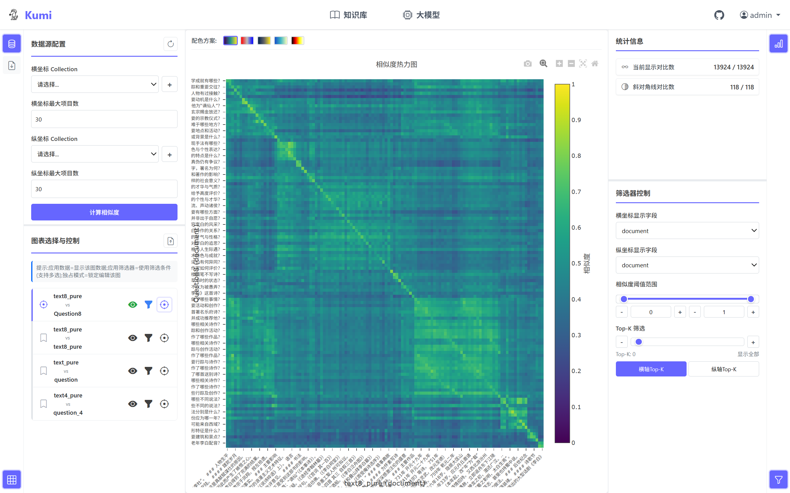
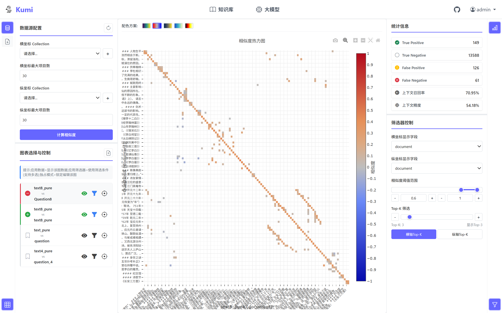

# KUMI
项目目标: 可视化的知识库测试，为您快速完成知识库效果评估





## 功能:
1. 高可视化的测评 自动化测试（embedding llm 前者直接进行本地召回操作 节省计算开支 后者调用dify api）
2. 更自由化的知识库构建（清洗 切分），支持以xlsx，csv，json等类表格格式导入切分完成的数据 暴露api接口给平台调用
3. 启动必要的插件接口（在网络层）

## 使用方法
<details id="使用方法">
<summary><strong>👉 点击展开：使用方法</strong></summary>

### 知识文件准备
- 关于如何将pdf等各类格式处理为知识文件（表格文件）
- 如果您的文件已经切分为表格文件形式 可以跳过本部分
<details id="知识文件准备">
<summary><strong>👉 点击展开：知识文件准备</strong></summary>

0. 文本化(尚未集成) 文本类pdf docx 建议使用 [markitdown](https://github.com/microsoft/markitdown); 图pdf ppt等需要图OCR的 建议使用 [MinerU](https://github.com/opendatalab/MinerU) (高算力高质量) 或 [PaddleOCR](https://github.com/PaddlePaddle/PaddleOCR) (高算力高质量)
1. 切分(脚本形式) 在 `scripts\md2qa` 新建 `input` 文件夹 将处理好的 `.md` 文件放入 执行 `step1_md2csv.py`.  这会切分你的`.md` 文件为`.csv`格式 并放在 `output` 文件夹中
2. 问答对生成(脚本形式)(用于多图对比测试) 执行 `step2_chunk2qa.py`. 这会为你在 `output` 文件夹中的 `.csv` 文件生成问题(一行一个) 并放在 `QA` 文件夹中


</details>

### 知识库导入
- 关于如何导入
<details id="知识库导入">
<summary><strong>👉 点击展开：知识库导入</strong></summary>

知识库 > 知识库上传 > 上传文件 > 预览文件 > 配置参数 > 选择使用字段 > 开始处理 

todo: 再完善一下 

</details>

### 知识库测试

<details id="知识库测试">
<summary><strong>👉 点击展开：知识库测试</strong></summary>


todo: 再完善一下 

</details>

</details>

## 部署方法
<details id="部署方法">
<summary><strong>👉 点击展开：部署方法</strong></summary>
<br>

以下包含三个部分 KUMI 知识库 向量化API。三者通过网络层连接，以下仅为方便部署举例，实际使用过程中知识库和向量化API可改为自己的。

### KUMI
```sh
# uv的安装和使用
# https://docs.astral.sh/uv/getting-started/installation/

# 创建环境并激活
uv venv --python 3.12
.venv\Scripts\activate

uv init
uv pip install -r requirements.txt -i https://pypi.tuna.tsinghua.edu.cn/simple

# 生成.env (也可以复制粘贴重命名) (修改 以配置登录用户名密码)
cp settings/.env.example settings/.env

# 生成 embedding_providers.yaml  (也可以复制粘贴重命名)(修改 以配置embedding服务使用)
cp settings/embedding_providers.yaml.example settings/embedding_providers.yaml

# 先等chroma和向量化 都启动了再执行这步
uv run scripts/start_dev.py
# 随后访问 127.0.0.1:8000/web 以访问Kumi界面 密码为.env文件中预先配置的 ADMIN_USER_NAME 和 ADMIN_PASSWORD
```

### 启动chroma
目前有写chromadb 和milvus的适配 为了跨平台部署的考虑默认选择了chroma 可自行增改
```sh
# 创建环境并激活（可以和kumi是一个环境）
uv venv --python 3.12
.venv\Scripts\activate

uv init
uv pip install chromadb -i https://pypi.tuna.tsinghua.edu.cn/simple

# https://docs.trychroma.com/docs/cli/run#running-a-chroma-server
chroma run --path storage/testdb --port 8081 --host 127.0.0.1

```

### 向量化API
如果有云端的API 则无需执行本步骤 在`embedding_providers.yaml`中配置即可
```sh
# 为向量化服务创建独立环境（可选）
uv venv --python 3.12

# 依赖安装
uv pip install sentence-transformers>=2.7.0 -i https://pypi.tuna.tsinghua.edu.cn/simple
uv pip install fastapi uvicorn accelerate -i https://pypi.tuna.tsinghua.edu.cn/simple

# 选择符合您机器的cuda版本（可选）（更大的模型建议GPU部署）
uv pip install torch torchvision torchaudio --index-url https://download.pytorch.org/whl/cu121

cd scripts

# 从魔搭下载模型（或huggingface等）（模型可更换 需要修改启动脚本以及配置）
uv pip install modelscope -i https://pypi.tuna.tsinghua.edu.cn/simple
modelscope download --model Qwen/Qwen3-Embedding-0.6B --local_dir ./Qwen3-Embedding-0.6B

# 这个部分只有一个代码 若修改模型 则执行本步骤前先修改代码配置
uv run embedding_serve.py --model_path ./Qwen3-Embedding-0.6B --model_name Qwen3-Embedding-0.6B
```

</details>

## 讨论群
<details id="讨论群">
<summary><strong>👉 点击展开：讨论群</strong></summary>
<br>


</details>

## 代码结构
<details id="代码结构">
<summary><strong>👉 点击展开：代码结构</strong></summary>
<br>

```md
KUMI/
├── README.md
├── requirements.txt
├── .env.example
├── .gitignore
├── main.py # FastAPI应用入口
├── config/
│ ├── __init__.py
│ ├── .env # 配置文件（数据库连接、API密钥等）
│ ├── settings.py
│ └── logging_config.py # 日志配置
├── database/
│ ├── __init__.py
│ ├── mysql/
│ │ ├── __init__.py
│ │ ├── connection.py # MySQL连接管理
│ │ ├── queries.py # SQL查询封装
│ │ └── models.py # SQLAlchemy模型
│ └── migrations/ # 数据库迁移文件
│ └── __init__.py
├── web/                    # 新增前端模块
│   ├── static/             # 静态资源
│   │   ├── css/
│   │   │   └── style.css
│   │   ├── js/
│   │   │   └── main.js
│   │   └── images/
│   │       └── logo.png
│   ├── templates/          # HTML模板
│   │   ├── base.html       # 基础模板
│   │   ├── index.html      # 首页
│   │   ├── login.html      # 登录页
│   │   └── pages/          # 各功能页面
│   │       ├── knowledge/
│   │       │   ├── embedding.html
│   │       │   ├── upload.html
│   │       │   └── test.html
│   │       └── llm/
│   │           ├── config.html
│   │           ├── upload_dataset.html
│   │           ├── upload_rules.html
│   │           └── evaluation.html
│   └── __init__.py
├── api/
│ ├── __init__.py
│ ├── auth.py
│ ├── knowledge.py # 知识库相关API代码
│ ├── document.py # 文档处理相关API代码
│ ├── web.py # 前端相关API代码
│ ├── knowledge_management.py # 知识库管理页面API代码
│ ├── knowledge_test.py # 知识库测试页面API代码
│ ├── llm_evaluation.py # 大模型测试页面API代码
│ └── models.py
├── services/
│ ├── __init__.py
│ └── knowledge_service.py # 知识库相关API代码
├── vector_db/
│ ├── __init__.py
│ ├── base.py
│ ├── chroma_client.py # Chroma向量库客户端
│ ├── embedding_client.py # 向量操作封装（增删改查）
│ └── factory.py
├── llm/
│ ├── __init__.py
│ ├── base.py # LLM基类
│ ├── openai_client.py # OpenAI接口
│ └── factory.py
├── tests/
│ ├── test_RAG/
│ │ ├── similarity_web_service.py
│ │ ├── similarity_service.py
│ │ └── static
│ │   └── index_heatmap.py
│ ├── test_QA/
│ │ ├── workflow_caller.py # 向工作流发起请求得到结果
│ │ └── model_evaluator.py # 将结果发送给大模型进行评价
│ └── test_integration/ # 集成测试
│   └── test_full_flow.py
├── dataset/
│ ├── dataset_csv_test/ # 测试数据集
│ ├── yaml_eval/ # 评测规则
│ ├── yaml_eval_templates/ # 评测规则模板
│ └── workflows.json # 工作流信息
├── scripts/
│ ├── embedding_process/ # 知识嵌入
│ │ ├── main.py # 运行以执行知识嵌入
│ │ └── vectoizer.py
│ ├── start_dev.py # api启动脚本
│ └── health_check.py # 健康检查脚本
└── main.py
```
</details>

## 致谢
- 本项目启发自 [jina-ai/correlations](https://github.com/jina-ai/correlations)